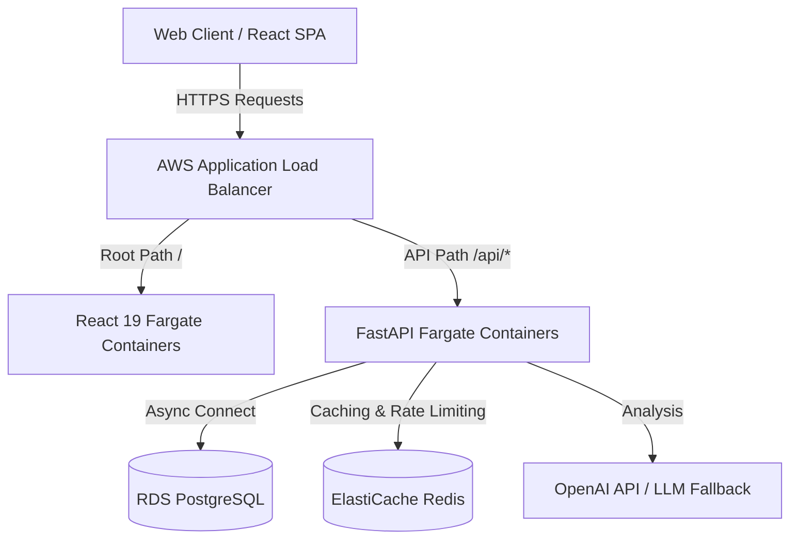
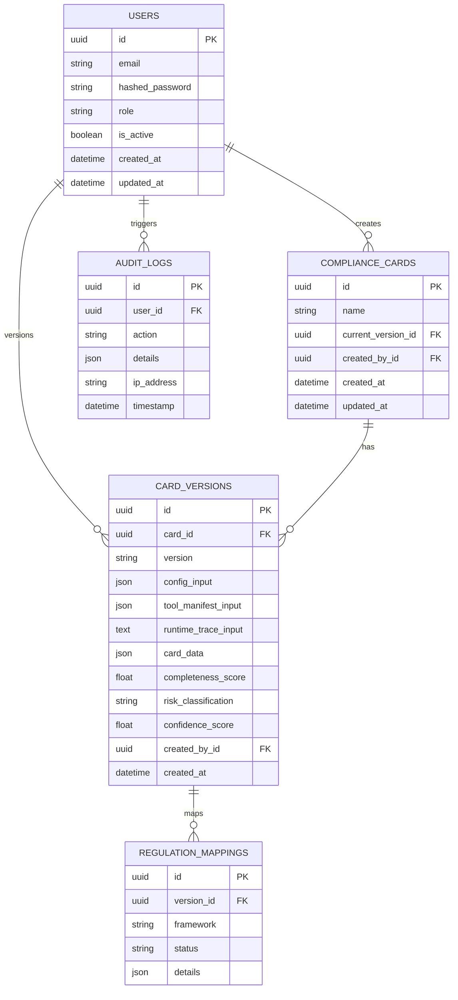

# System Architecture & API Specifications

This document outlines the system architecture, ER database diagram, and core REST API specifications for the Agent Compliance Card Generator.

## Architecture Block Diagram

## Entity Relationship (ER) Diagram

## REST API Specification (v1)

### Authentication
- `POST /api/v1/auth/register`: Create a new developer or auditor user profile.
- `POST /api/v1/auth/login`: Authenticate email and password, returning JWT access and refresh tokens.
- `POST /api/v1/auth/refresh`: Refresh an expired access token.
- `GET /api/v1/auth/me`: Fetch profile information of the currently authenticated user.

### Compliance Cards
- `GET /api/v1/cards/`: List compliance cards with filters for search query (`search`) and risk level (`risk`).
- `POST /api/v1/cards/`: Compile inputs (config, tool manifest, trace logs) and generate a new compliance card.
- `GET /api/v1/cards/{card_id}`: Retrieve card details.
- `PUT /api/v1/cards/{card_id}`: Upload updated inputs, triggering a semver bump and recalculation.
- `GET /api/v1/cards/{card_id}/versions`: Get the list of all historical versions for the card.
- `GET /api/v1/cards/{card_id}/diff`: Calculate semantic differences between two card versions.
- `GET /api/v1/cards/{card_id}/export/pdf`: Stream a professional PDF report.
- `GET /api/v1/cards/{card_id}/export/json`: Download card specifications in structured JSON.

### Auditing
- `GET /api/v1/audit/`: List system audit logs (auditors and administrators only).
